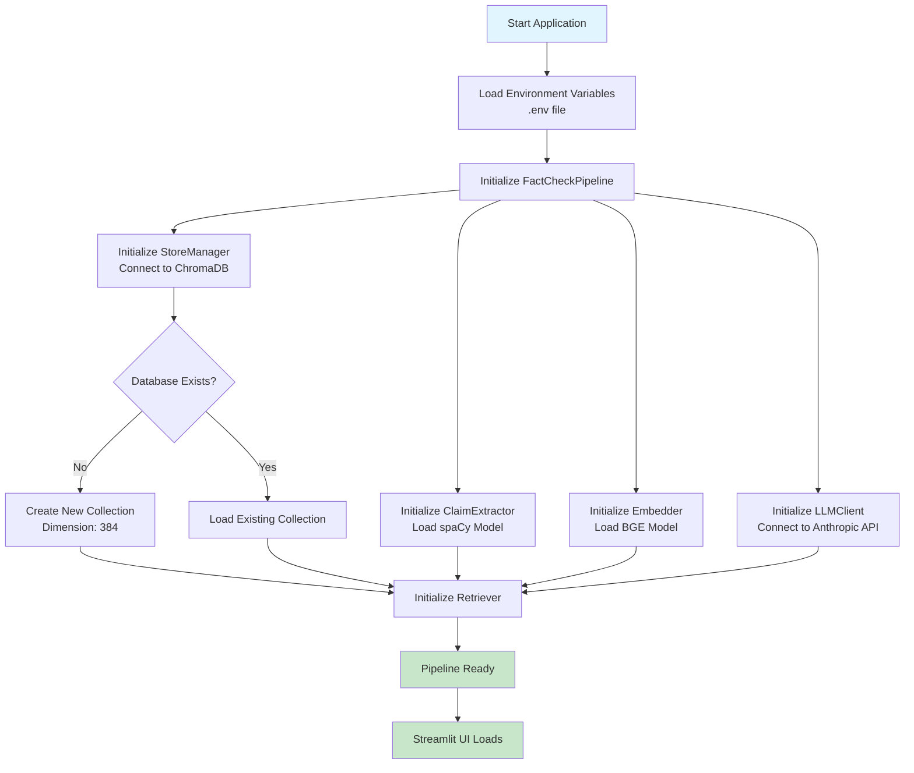
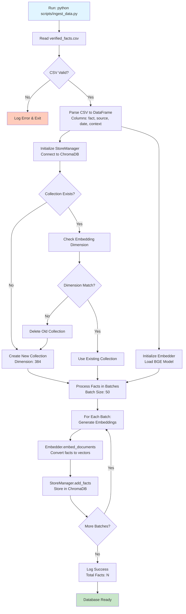
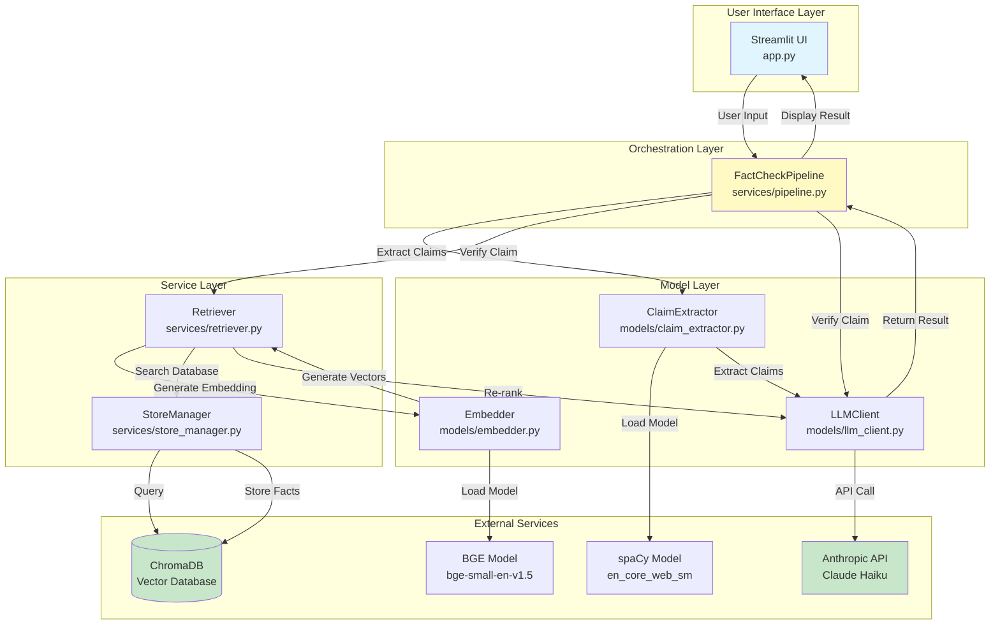

# 🔄 Application Flow & Data Travel

This document explains how the LLM Fact Checker application works, including the complete data flow from user input to verification results.

---

## 📋 Table of Contents

1. [System Setup Flow](#1-system-setup-flow)
2. [User Request Flow](#2-user-request-flow)
3. [Claim Verification Flow](#3-claim-verification-flow)
4. [Data Ingestion Flow](#4-data-ingestion-flow)
5. [Component Interactions](#5-component-interactions)

---

## 1. System Setup Flow

This flow shows how the application initializes and prepares the database.



---

## 2. User Request Flow

This flow shows how a user's claim verification request travels through the system.

```mermaid
flowchart LR
    A[User Input<br/>Streamlit UI] --> B[app.py<br/>verify_claim]
    B --> C[FactCheckPipeline<br/>verify_claim]
    C --> D[Retriever<br/>search_and_rerank]
    D --> E[Embedder<br/>Generate Query Embedding]
    E --> F[StoreManager<br/>Search ChromaDB]
    F --> G[Retriever<br/>Filter by Threshold<br/>Similarity >= 0.65]
    G --> H{Evidence Found?}
    H -->|No| I[Return Unverifiable<br/>No evidence in database]
    H -->|Yes| J[Retriever<br/>Re-rank Results<br/>Top 3 facts]
    J --> K[LLMClient<br/>verify_claim]
    K --> L[Anthropic API<br/>Claude Haiku 4.5]
    L --> M[Parse JSON Response<br/>verdict, reasoning, confidence]
    M --> N[Normalize Verdict<br/>Based on confidence]
    N --> O[Format Result Object]
    O --> P[Display in UI]
    
    style A fill:#e1f5ff
    style P fill:#c8e6c9
    style I fill:#ffccbc
```



---

## 3. Claim Verification Flow

Detailed step-by-step flow of the claim verification process.

```mermaid
flowchart TD
    Start([User Submits Claim]) --> PipelineVerify[FactCheckPipeline.verify_claim<br/>Log claim]
    PipelineVerify --> RetrieverSearch[Retriever.search_and_rerank<br/>Find relevant facts]
    RetrieverSearch --> EmbedQuery[Embedder.embed_query<br/>Convert claim to vector<br/>Dimension: 384]
    EmbedQuery --> SearchDB[StoreManager.search<br/>Query ChromaDB<br/>Top-K: 5 results]
    SearchDB --> FilterThreshold[Retriever.search<br/>Filter by threshold<br/>Similarity >= 0.65]
    FilterThreshold --> CheckEvidence{Evidence Found?}
    CheckEvidence -->|No| Unverifiable1[Return: Unverifiable<br/>No relevant evidence<br/>confidence: 0.0]
    
    CheckEvidence -->|Yes| Rerank[Retriever.rerank<br/>Re-rank by relevance<br/>LLM-based or similarity<br/>Top-K: 3 results]
    Rerank --> FormatEvidence[Pipeline.verify_claim<br/>Format Evidence<br/>Combine top 3 facts<br/>Include source & date]
    FormatEvidence --> LLMVerify[LLMClient.verify_claim<br/>Send to Claude API<br/>Model: claude-haiku-4-5-20251001]
    
    LLMVerify --> LLMProcess[Claude Processes:<br/>- Claim<br/>- Evidence<br/>Returns JSON]
    LLMProcess --> ParseResponse[LLMClient.parse JSON<br/>Extract: verdict, reasoning, confidence]
    
    ParseResponse --> NormalizeVerdict{Check Verdict Type}
    NormalizeVerdict -->|TRUE + confidence>=0.8| VerdictDT[Definitely True]
    NormalizeVerdict -->|TRUE + confidence>=0.6| VerdictLT[Likely True]
    NormalizeVerdict -->|TRUE + confidence<0.6| VerdictPT[Possibly True]
    NormalizeVerdict -->|FALSE + confidence>=0.8| VerdictDF[Definitely False]
    NormalizeVerdict -->|FALSE + confidence>=0.6| VerdictLF[Likely False]
    NormalizeVerdict -->|FALSE + confidence<0.6| VerdictPF[Possibly False]
    NormalizeVerdict -->|Other| VerdictUnverifiable[Unverifiable]
    
    VerdictDT --> FormatResult[Format Result Object]
    VerdictLT --> FormatResult
    VerdictPT --> FormatResult
    VerdictDF --> FormatResult
    VerdictLF --> FormatResult
    VerdictPF --> FormatResult
    VerdictUnverifiable --> FormatResult
    Unverifiable1 --> FormatResult
    
    FormatResult --> ReturnResult[Return to Pipeline:<br/>{<br/>  verdict: str,<br/>  reasoning: str,<br/>  evidence: List[str],<br/>  confidence: float<br/>}]
    ReturnResult --> Display[Display in Streamlit UI]
    Display --> End([End])
    
    style Start fill:#e1f5ff
    style End fill:#c8e6c9
    style Unverifiable1 fill:#ffccbc
    style VerdictDT fill:#c8e6c9
    style VerdictLT fill:#c8e6c9
    style VerdictPT fill:#fff9c4
    style VerdictDF fill:#ffcdd2
    style VerdictLF fill:#ffcdd2
    style VerdictPF fill:#ffccbc
    style VerdictUnverifiable fill:#fff9c4
```

---

## 4. Data Ingestion Flow

This flow shows how verified facts are ingested into the database.



---

## 5. Component Interactions

This diagram shows how different components interact with each other.



---

## 📊 Data Flow Summary

### Input → Output Flow

1. **User Input** (Text/Claim)
   - ↓
2. **Claim Extraction** (spaCy or LLM)
   - ↓
3. **Embedding Generation** (BGE Model → 384-dim vector)
   - ↓
4. **Vector Search** (ChromaDB → Top-K similar facts)
   - ↓
5. **Similarity Filtering** (Threshold: 0.65)
   - ↓
6. **Re-ranking** (LLM-based or similarity-based)
   - ↓
7. **Evidence Formatting** (Top 3 facts with metadata)
   - ↓
8. **LLM Verification** (Claude API → verdict + reasoning)
   - ↓
9. **Result Formatting** (JSON → Python dict)
   - ↓
10. **UI Display** (Streamlit → User sees result)

### Data Formats

**Input:**
- User Claim: `str` (e.g., "The government announced free electricity")

**Intermediate:**
- Embedding: `List[float]` (384 dimensions)
- Search Results: `List[Dict]` with `text`, `metadata`, `similarity`
- Evidence: `str` (formatted text with sources)

**Output:**
```python
{
    "claim": str,
    "verdict": "Definitely True" | "Likely True" | "Possibly True" | 
               "Definitely False" | "Likely False" | "Possibly False" | 
               "Unverifiable",
    "reasoning": str,
    "evidence": List[str],
    "confidence": float (0.0-1.0)
}
```

---

## 🔍 Key Decision Points

1. **Similarity Threshold**: If top result similarity < 0.65 → Return "Unverifiable"
2. **Evidence Availability**: If no facts found in database → Return "Unverifiable"
3. **LLM Verdict**: Claude analyzes claim + evidence → Returns True/False/Unverifiable in JSON format
4. **Verdict Normalization**: Based on confidence score:
   - True + confidence >= 0.8 → "Definitely True"
   - True + confidence >= 0.6 → "Likely True"
   - True + confidence < 0.6 → "Possibly True"
   - False + confidence >= 0.8 → "Definitely False"
   - False + confidence >= 0.6 → "Likely False"
   - False + confidence < 0.6 → "Possibly False"
   - Other → "Unverifiable"

---

## 📝 File Responsibilities

| File | Purpose | Data Flow |
|------|---------|-----------|
| `app.py` | UI entry point | User input → Pipeline → Display result |
| `services/pipeline.py` | Orchestrator | Coordinates all components |
| `services/retriever.py` | Search logic | Query → Embedding → Search → Re-rank |
| `services/store_manager.py` | Database wrapper | CRUD operations on ChromaDB |
| `models/llm_client.py` | LLM interface | Claim + Evidence → API → Verdict |
| `models/embedder.py` | Embedding generator | Text → Vector (384-dim) |
| `models/claim_extractor.py` | Claim extraction | Text → List of claims |
| `scripts/ingest_data.py` | Data ingestion | CSV → Embeddings → ChromaDB |

---

## 🚀 Quick Reference

**To verify a claim:**
1. User enters claim in Streamlit UI
2. System generates embedding for the claim
3. System searches database for similar facts (similarity >= 0.65)
4. System re-ranks results and selects top 3 facts
5. System sends claim + evidence to Claude API
6. System parses JSON response and normalizes verdict based on confidence
7. System displays verdict + reasoning + evidence in UI

**To add new facts:**
1. Add facts to `data/verified_facts.csv`
2. Run `python scripts/ingest_data.py`
3. Facts are embedded and stored in ChromaDB
4. Facts are now searchable for verification

---

## 📌 Notes

- **Embedding Dimension**: All embeddings are 384-dimensional vectors (BGE-small model)
- **Similarity Metric**: Cosine similarity (1.0 - distance)
- **Threshold**: 0.65 similarity required for evidence to be considered
- **Top-K Retrieval**: 5 facts retrieved, top 3 used for verification
- **Batch Processing**: Facts ingested in batches of 50 for efficiency
- **LLM Model**: Claude Haiku 4.5 (claude-haiku-4-5-20251001) - configured in `config.py`
- **Verdict Format**: Verdicts are normalized based on confidence (Definitely/Likely/Possibly True/False)

